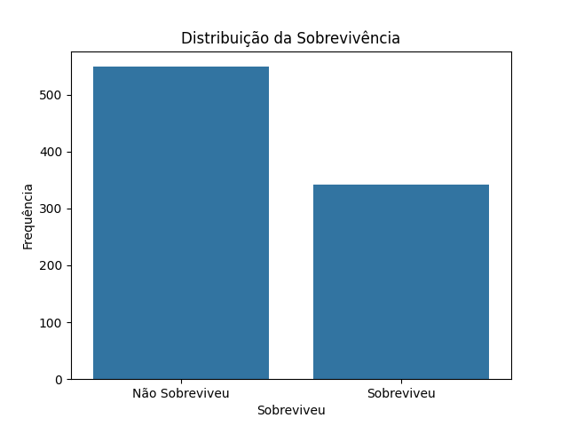
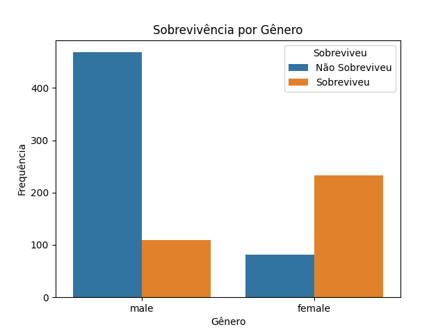
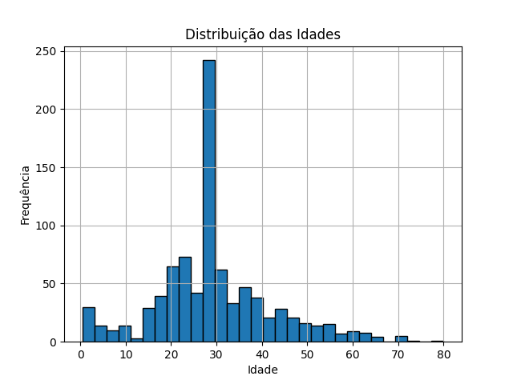

# Titanic Data Analysis

## Descrição
Este projeto realiza uma análise exploratória dos dados do Titanic para identificar padrões e insights sobre os sobreviventes. Usamos Python com bibliotecas como Pandas, Seaborn e Matplotlib para visualizações e análises.

## Estrutura do Projeto
- `titanic_analysis.py`: Script Python contendo todo o processo de análise exploratória.
- `data/titanic.csv`: Dados de treinamento usados para a análise.
- `README.md`: Descrição do projeto e instruções de uso.
- `requirements.txt`: Lista de dependências necessárias para executar o projeto.

## Instalação
Clone o repositório e instale as dependências:
```bash
git clone https://github.com/MateusFenoci/titanic-data-analysis.git
cd titanic-data-analysis
pip install -r requirements.txt
```

## Uso
Execute o script principal para gerar as visualizações:
```bash
python titanic_analysis.py
```

## Resultados
- Visualizações das distribuições dos dados.
- Análise das correlações entre variáveis.
- Tratamento de dados faltantes.

### Exemplo de Visualizações
#### Distribuição da Sobrevivência


#### Sobrevivência por Gênero


#### Distribuição de Idades


## Referências
- [Dataset do Titanic](https://www.kaggle.com/c/titanic/data)

## Licença
Este projeto está licenciado sob a licença MIT.
